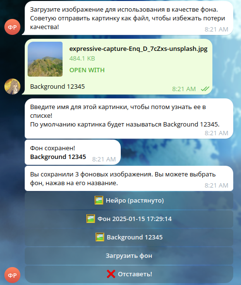
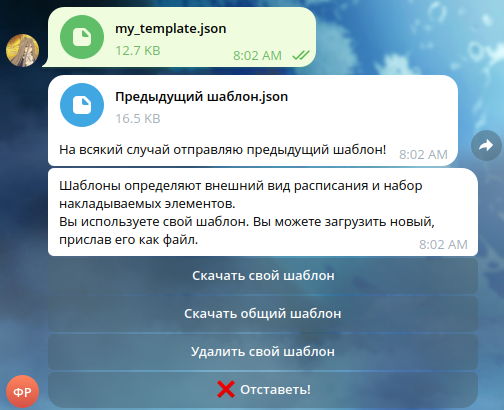
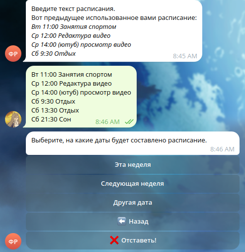
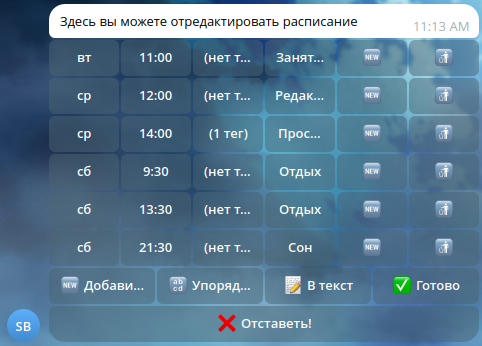
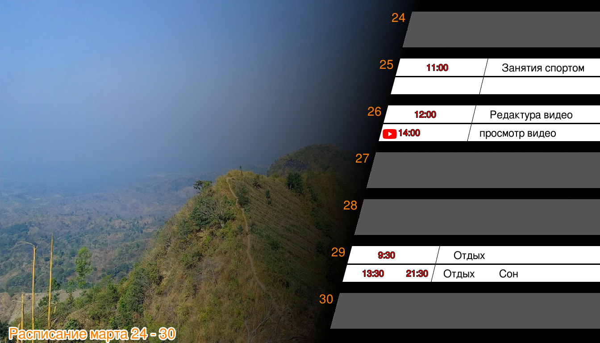

> [!NOTE]  
> Данное описание создано с помощью нейросети DeepSeek.


# Schedule Bot

**Schedule Bot** — это Telegram-бот, который помогает создавать изображения с расписанием на неделю в единообразном стиле без использования специальных программ.
Вы можете загрузить своё фоновое изображение, выбрать готовый шаблон оформления и ввести расписание в текстовом формате.
Бот создаст расписание, объединив фон, текст расписания и другие определенные шаблоном элементы и отправит его вам.

---


## Что умеет бот?

- **Загружать фоновые изображения.** Вы можете использовать свои картинки как фон для расписания. Загруженные изображения сохраняются, и вы можете выбирать их из списка для новых расписаний.
- **Работать с шаблонами.** Шаблоны задают, как будет выглядеть ваше расписание: где и каким шрифтом будет написан текст, какие будут использоваться цвета и дополнительные элементы.
- **Принимать расписание в текстовом формате.** Вы вводите расписание в виде текста, например: `понедельник 12:00 (спорт) бег`. Бот автоматически разместит его на изображении.
- **Работать с расписанием при помощи специального редактора.** Вместо ввода расписания в виде текста можно использовать редактор.
- **Генерировать и отправлять изображения.** После ввода данных бот создаст готовое изображение с вашим расписанием и отправит его вам.


### Пример работы бота

1. Пользователь запускает бота и загружает фоновое изображение.  
     

2. Пользователь загружает отдельно подготовленный для него шаблон.
   Эта операция выполняется только один раз - шаблон для каждого пользователя сохраняется и используется до тех пор, пока не будет заменен.
   В репозитории представлен пример [шаблона](assets/my_template_smol.json).
   Для его использования требуется предварительная загрузка администратором всех накладываемых изображений.  
     

3. Пользователь вводит расписание в текстовом формате или в редакторе.  
     
     

4. Бот генерирует изображение и отправляет его пользователю.  
   


## Требования для запуска

- Сервер/ВМ с ОС Linux;
- Установленный Docker;
- Доступ к интернету для связи с Telegram;
- Минимально рекомендуемые параметры:
  - RAM: 2048 Mb;
  - CPU: 1 core;
  - SSD: 5 Gb.


## Установка и запуск

1. Скопируйте файл `.env.example` в `.env` и настройте переменные окружения.
   Описание настраиваемых переменных окружения:

    | Переменная         | Пример значения                                           | Описание                                                                                                                                          |
    |--------------------|-----------------------------------------------------------|---------------------------------------------------------------------------------------------------------------------------------------------------|
    | `TOKEN`            | `1111111111:AAAAAAAAAAAAAAAAAAAAAAAAAAAAa`                | Токен Telegram-бота. Его необходимо получить самостоятельно у бота BotFather.                                                                     |
    | `LOG_LEVEL`        | `INFO`                                                    | Уровень логирования (например, `INFO`, `DEBUG`).                                                                                                  |
    | `DB_URL`           | `postgresql+asyncpg://user:password@db:5432/schedule_bot` | URL для подключения к PostgreSQL. При использовании `docker-compose.yaml` из репозитория замените только username и пароль.                       |
    | `POSTGRES_USER`    | `schedule_bot`                                            | Имя пользователя для подключения к PostgreSQL. Используется только для настройки контейнера postgresql, для работы бота настройте `DB_URL`.       |
    | `POSTGRES_PASSWORD`| `example_password`                                        | Пароль для подключения к PostgreSQL. Используется только для настройки контейнера postgresql, для работы бота настройте `DB_URL`.                 |
    | `ADMIN_ID`         | `-1`                                                      | ID первого администратора бота в Telegram. Если не указан или равен `0` или `-1`, администраторов можно будет назначить только через базу данных. |
    | `SOURCE_CODE_URL`  | `https://github.com/developer/repository`                 | Ссылка на репозиторий с исходным кодом - основной репозиторий либо форк. Это необходимо в соответствии с используемой лицензией.                  |

2. Соберите Docker-образы:
   ```bash
   docker compose build
   ```

3. Запустите проект:
   ```bash
   docker compose up
   ```

4. Проверьте работоспособность бота, отправив команду `/start` в Telegram созданному при получении токена аккаунту.

## Архитектура проекта

Проект разделен на несколько микросервисов, взаимодействующих через брокер сообщений NATS. Основные сервисы:

- **bot:** Основной сервис, обрабатывающий команды пользователя и взаимодействующий с Telegram API.
- **sender:** Отправляет готовые изображения пользователю.
- **renderer:** Генерирует изображения с расписанием на основе шаблонов и данных пользователя.
- **converter:** Конвертирует изображения пользователя, подгоняя их под нужный размер.
- **db:** База данных PostgreSQL для хранения данных пользователей (фоновые изображения, тексты расписаний, загруженные шаблоны).
- **nats:** Брокер сообщений для взаимодействия между микросервисами.
- **dbeaver:** Веб-интерфейс для управления базой данных.
- **nats-nui:** Веб-интерфейс для мониторинга и управления NATS.

## Технологический стек

- **Python:** Основной язык программирования.
- **aiogram и aiogram-dialogs:** Библиотеки для работы с Telegram API.
- **PostgreSQL:** База данных для хранения информации о пользователях.
- **NATS:** Брокер сообщений для взаимодействия между микросервисами.
- **Docker:** Контейнеризация и управление сервисами.

## Шаблоны

Шаблоны задают оформление расписания (шрифты, цвета, положение текста). Они хранятся в формате JSON и загружаются в Pydantic-модель.
Пример шаблона можно найти в репозитории: [my_template.json](assets/my_template_smol.json)

## Лицензия

Проект распространяется под лицензией **GNU Affero General Public License**. Подробности см. в файле [LICENSE](LICENSE).
